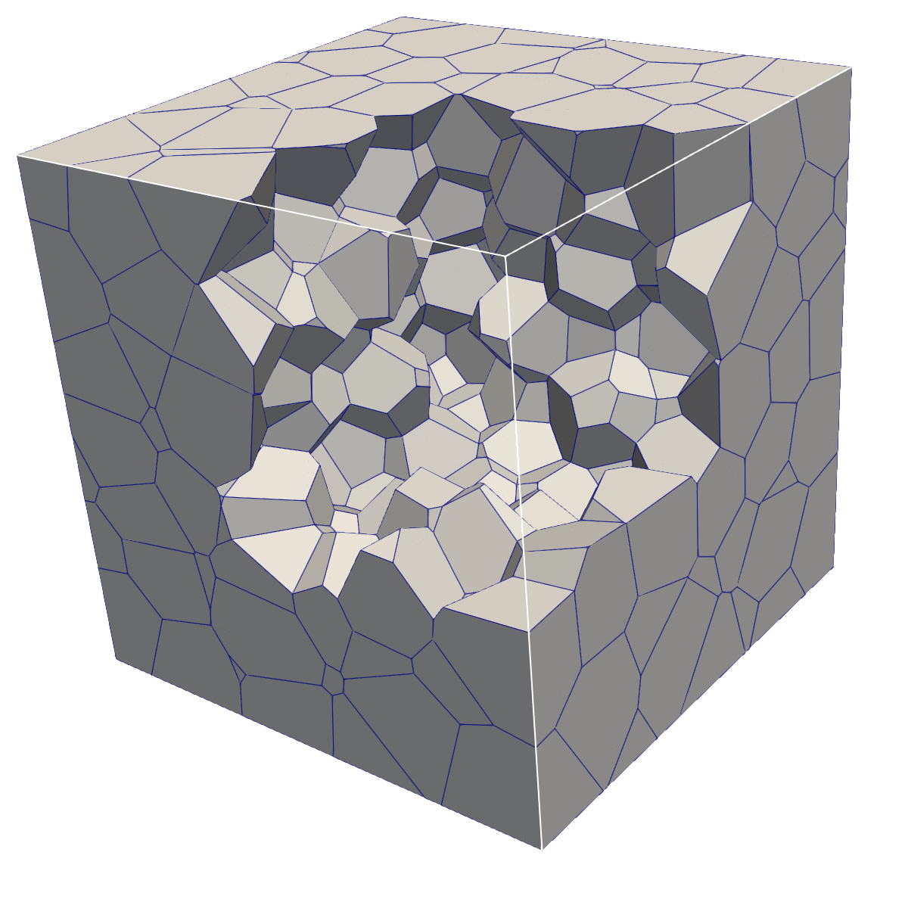

# voroToFoam - Voronoi meshes for OpenFOAM #
A tool to generate Voronoi meshes for [OpenFOAM-10](https://github.com/OpenFOAM/OpenFOAM-10)
coupled with [voro++](https://math.lbl.gov/voro++/).

NOTE: it should be compatible also with older versions of OpenFOAM. Tested on [OpenFOAM-7](https://github.com/OpenFOAM/OpenFOAM-10).

## Setup and installation ##
First install the voro++ library from [this site](https://math.lbl.gov/voro++/download/) and follow the installation instructions.

Once the underlying OpenFOAM version is loaded, run the `Allwmake` script to compile the application.

NOTE: please change the library path if needed in `voroToFoam/Make/options`
```-I<VORO++_LIBRARY_PATH>/voro++```

## Usage ##
A cloud of points must be available in a file with the following structure:
```
<label> <scalar> <scalar> <scalar>
id0 x0 y0 z0
id1 x1 y1 z1
...
```

A typical syntax can then be:
```
voroToFoam -tol 1e-8 -cubeSide 0.5 points.dat
```

It is advisable to run `renumberMesh -overwrite` after.

NOTE: I have used this tool together with [tetgen](https://wias-berlin.de/software/tetgen/) or [GMSH](https://gmsh.info/).

## Tutorials

### Cube
Starting from a cloud of points in `points.dat`, the following grid is obtained



## TODO ##
* Avoid zero area faces: [reference](github.com/alfiogn/voroToFoam/blob/master/applications/voroToFoam/voronoiMesh.C?plain=304)
* The mesh generation can be extended to generic shapes, like in [this site](https://math.lbl.gov/voro++/examples/)
* Parallel implementation

